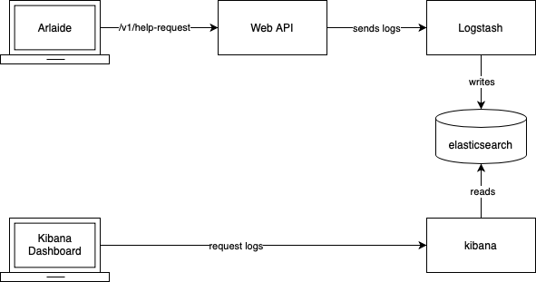
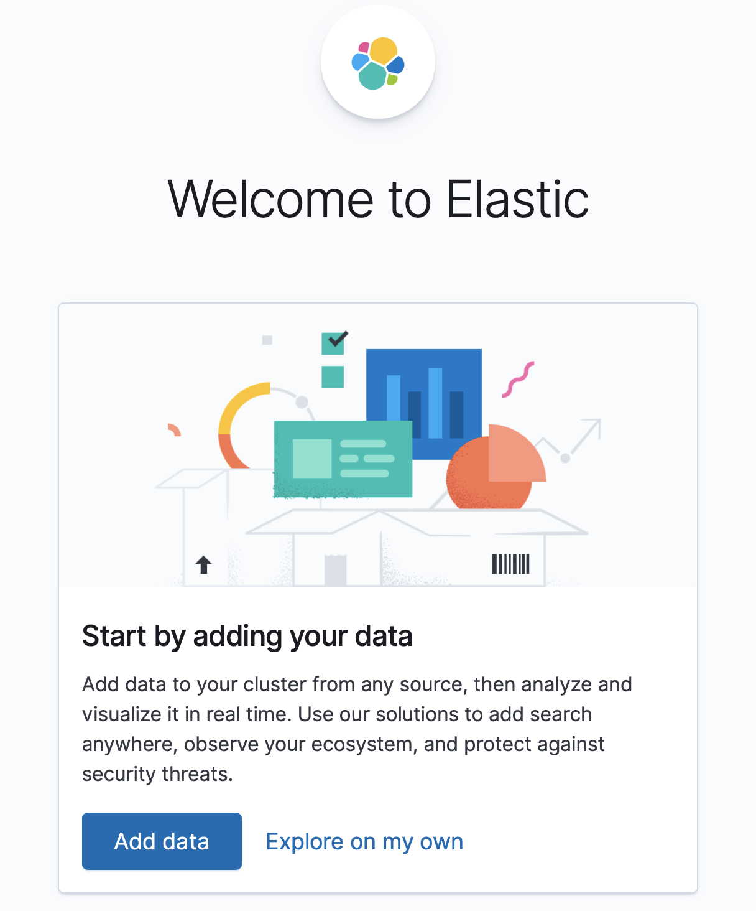
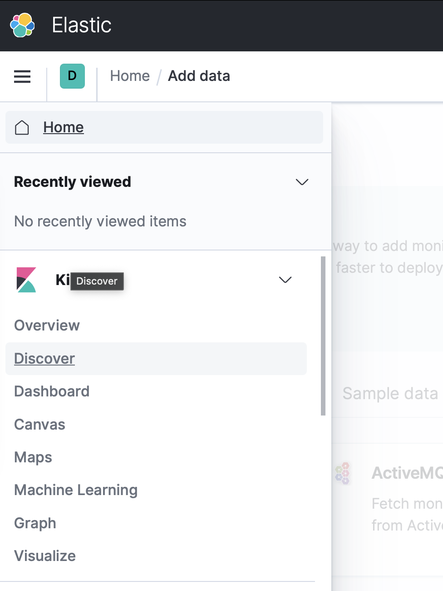
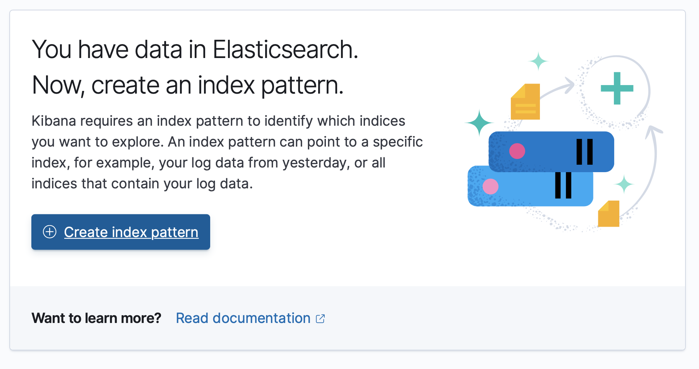
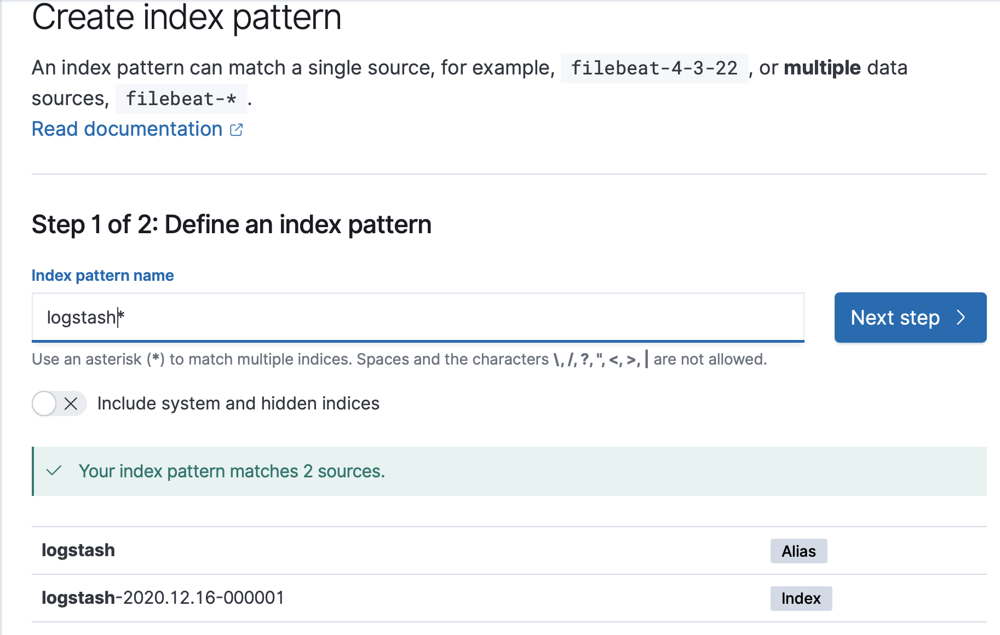
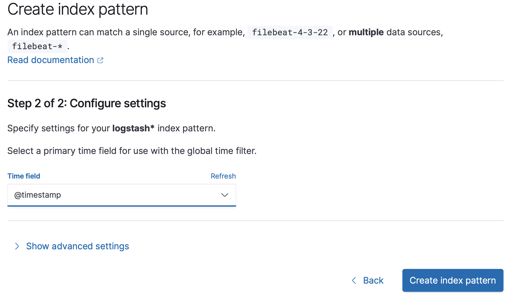
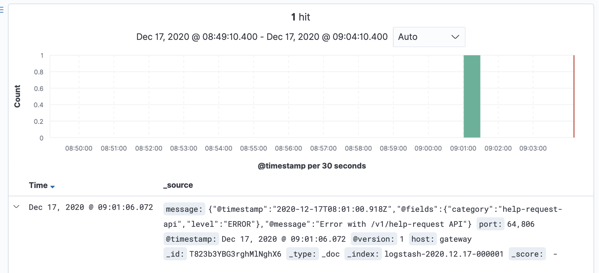

# Logging Workshop

This workshop is for student of EPITA SIGL 2021.

You will add some logging (not login!) to your arlaide web api.
Those logs to an ELK (Elastic, Logstash, Kibana) stack.

Here are differents the different tools in actions:



You will deploy all those tools on your localhost, and try out to visualize logs on Kibana,
base on the usage of Arlaide on your localhost.

## Step 1: Setup a local ELK stack

In this step, you start an ELK stack:
- a container for ElasticSearch database to hold your logs
- a container for Logstash to ingest logs from your API
- a container to expose Kibana on your localhost

We found a nice all-in-one github repository that launches the latest ELK stack using a single docker-compose file.

To run ELK on your local machine:

1. Clone [deviantony/docker-elk](https://github.com/deviantony/docker-elk) project inside this repository
1. run the docker compose file in daemon mode: 
```sh
cd docker-elk
docker-compose up -d
```
> This may take a while to get all docker images (some hundreds of megabytes).

Once your container are running, give Kibana a minute to start, and check if you can reach kibana from your browser on http://localhost:5601

Credentials are `elastic/changeme`.

Please don't perform any action yet, as we didn't send any logs.

Once we send the first logs, kibana setup will be easier.

## Step 2: Send logs from Arlaide web api

Let's add a new logger, connected to your local logstash.

### Install new dependencies

You need to install the following node modules in your web api: 
1. `log4js` to have logging tagged with specific names. And different level of loggings (`trace`, `debug`, `info`, `warn` and `error`)
1. `log4js-logstash` an adapter for `log4js` to send logs to a remote Logstash instance

To do so, from your arlaide's `api/` folder, install modules:
```sh
# from api/
nvm use
npm i --save log4js log4js-logstash
```

### Log some information

Let's configure a new logger for your web api.

First, you need to configure your logger to connect to your logstash.

Add the following code snipet to your `api/src/server.ts` file:
```ts
// ...
import log4js from "log4js";
// ...

// Configure logger
const loggerConfig: log4js.Configuration = {
  appenders: {
    stdout: {
      type: "console",
      layout: {
        type: "coloured",
      },
    },
    logstash: {
      type: "log4js-logstash",
      host: "localhost",
      port: 5000,
    },
  },
  categories: {
    default: {
      appenders: ['stdout', 'logstash'],
      level: 'trace'
    }
  },
};

log4js.configure(loggerConfig);

// get a new logger instance tagged with `help-request-api`
const apiLogger = log4js.getLogger("help-request-api");

// app.use(...)
// ...

```

This configure a new logger that will output logs on:
- your console, thanks to the console appender
- your logstrash instance running on your localhost, thanks to log4js-logstash appender

You have set in `categories` default behaviour to send all log's **level** to both appenders.

Your differents log's **level** are:
- `trace`: when you need to use it to track a request path, this is for very specific debug sessions
- `debug`: when you want to debug some values in some functions
- `info`: when you want to logs some information to help you understand usage of your app
- `warning`: when something is wrong, but not critical for the user
- `error`: when an error is thrown, and it's a bug.

When you set your logging level to `trace` in your `log4js` config options, it means that **ALL** log levels from trace to error will be send to both `console` and `logstash` appenders.

If you set your log level to `error` in the `categories.default.level` config, only logs with `error` level will be sent.

**How to use those log levels?**

You have just configured an `apiLogger` using `log4js.getLogger`. 

Adapt your `/v1/help-request` api code in your `api/src/server.ts` file to add logging:

```ts
// inside api/src/server.ts
app.get(
  "/v1/help-request",
  jwtCheck,
  async (request: express.Request, response: express.Response) => {
    // Getting value of page and limit query options:
    // ex: http://<domain>/v1/help-request?page=1&limit=10
    //  page == 1
    //  limit == 10
    try {
      const { page, limit } = extractPageOptions(request.query);

      // Query the page of help requests from the fake database
      const helpRequests: UserHelpRequest[] = await RDS.getHelpRequests(
        page,
        limit
      );

      apiLogger.info('Success call on /v1/help-request', {page, limit});
      // sends the response back to the client, when node will be ready!
      response.send(helpRequests);
    } catch (e) {
      // Something went wrong internally to the API,
      // so we are returning a 500 HTTP status
      response.statusCode = 500;
      apiLogger.error('Error with /v1/help-request API', {error: e.message});
      response.send({ error: e.message });
    }
  }
);
```

You just added an `info` log level when your query is a success:
```ts
apiLogger.info('Success call on /v1/help-request', {page, limit});
```
and and `error`log level when your query has failed for any bad reasons:
```ts
apiLogger.error('Error with /v1/help-request API', {error: e.message});
```

This will help you to roughly know how many failed vs success requests you have on your help-request API.

Make sure your api compiles by running `nvm use && npm run build` from your api/ directory.

### Step 3: Produce some logs

Run your frontend and your api on your local machine.

Run frontend in one shell:
```sh 
# from frontend/
nvm use
npm start
```

Run api in another shell:
```sh
# from api/
nvm use
npm start
```

Start your `docker-compose` from the arlaide-database workshop, to have your Postgres instance running.

Now, navigate to your app and load some help requests.

If you see some `INFO` or `ERROR` logs on your stdout, you can proceed to the next step.

### Step 4: Configure Kibana to read from elasticSearch

Go to kibana dashboard on http://localhost:5301

Login using `elasctic/changeme` as credentials.

You should see a welcome screen like:


Click on `Add data`

Then on the sidebar menu icon, select the discover section:



Then, you should see that kibana noticed you have some logs in your elasticsearch, but you don't have any indexes yet to search on those logs.

Let's create them!

Select `Create index` button:


For step 1 of index creation, enter `logstash` as index pattern name, and click `Next step`:


For step 2 of index creation, you need to select the field that reprensents the log timestamp. Select @timestamp form the filed selector:


Now, click on `create index pattern` after selecting timestamp field.

Go back to the sidebar menu > discover view.

You should see your logs from previous step:


By default, it shows logs from latest 15 minutes, you can increase the time range to find back your logs if it was more that 15 minutes ago.

Congratulation!! You've just setup a whole ELK stack and connect logs from your API.

Now, you can produce more logs of different level, and try to query them in the discover section, create dashboard with custom visualizations and more.

